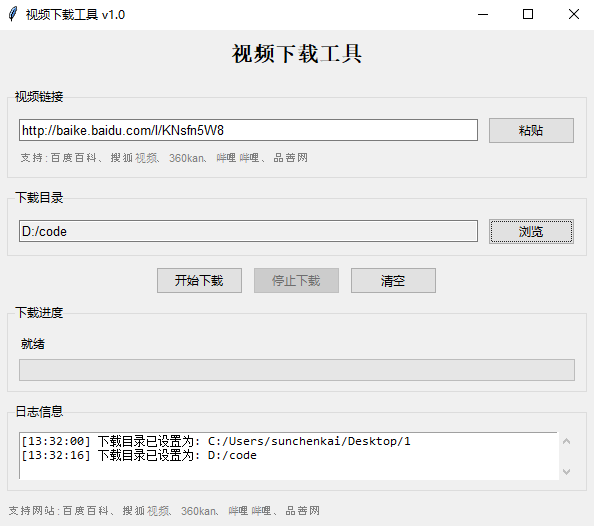

# Video Downloader

A powerful multi-platform video downloader supporting various video websites including Bilibili, Baidu Baike, Sohu Video, 360kan, and Pinshan.

## Features

- **Multi-platform Support**: Download videos from Bilibili, Baidu Baike, Sohu Video, 360kan, and Pinshan
- **GUI Interface**: User-friendly graphical interface built with tkinter
- **CLI Support**: Command-line interface for automated downloads
- **Auto-parsing**: Intelligent video URL parsing and extraction
- **Resume Downloads**: Support for resuming interrupted downloads
- **Progress Display**: Real-time download progress with detailed logging
- **Error Handling**: Robust error handling with retry mechanisms
- **Format Selection**: Automatic best quality selection with fallback options
- **Audio/Video Merging**: Automatic merging of separate audio and video streams

## System Requirements

- Python 3.7 or higher
- Windows, macOS, or Linux
- FFmpeg (included in the project)
- Chrome browser (for Selenium-based extraction)

## Installation

1. **Clone the repository**:
   ```bash
   git clone https://github.com/your-username/video-downloader.git
   cd video-downloader
   ```

2. **Install dependencies**:
   ```bash
   pip install -r requirements.txt
   ```

3. **Run the application**:
   
   **GUI Version**:
   ```bash
   python src/video_downloader_gui.py
   ```
   
   **CLI Version**:
   ```bash
   python src/video_downloader.py <video_url>
   ```

## Screenshots

### GUI Interface


*Main application interface with URL input and download options*


*Download progress display with real-time status updates*

## Usage

### GUI Interface

1. Launch the GUI application
2. Paste or enter the video URL in the input field
3. Select the download directory
4. Click "Download" to start the process
5. Monitor progress in the log area

### Command Line Interface

```bash
# Download a single video
python src/video_downloader.py "https://www.bilibili.com/video/BV1234567890"

# Specify custom download directory
python src/video_downloader.py "https://www.bilibili.com/video/BV1234567890" --output ./downloads
```

### Supported Websites

| Website | Status | Notes |
|---------|--------|---------|
| Bilibili | ✅ Supported | Full support with audio/video merging |
| Baidu Baike | ✅ Supported | Video extraction from encyclopedia pages |
| Sohu Video | ✅ Supported | Standard video downloads |
| 360kan | ⚠️ Limited | Requires Selenium for some videos |
| Pinshan | ✅ Supported | Educational content platform |
| YouTube | ✅ Supported | Via yt-dlp integration |

## Project Structure

```
video-downloader/
├── src/                    # Source code
│   ├── __init__.py        # Package initialization
│   ├── video_downloader.py # Core downloader logic
│   ├── video_downloader_gui.py # GUI interface
│   ├── config.py          # Configuration settings
│   ├── main_downloader.py # Main entry point
│   └── optimized_video_downloader.py # Optimized version
├── docs/                   # Documentation
├── tests/                  # Test files
├── examples/              # Usage examples
├── scripts/               # Utility scripts
├── ffmpeg/                # FFmpeg binaries
├── requirements.txt       # Python dependencies
├── setup.py              # Package setup
├── LICENSE               # License file
└── README.md             # This file
```

## Configuration

The application uses a centralized configuration system in `src/config.py`. You can customize:

- Download directories
- Quality preferences
- Retry settings
- Timeout values
- User agents
- Site-specific settings

## Dependencies

### Core Dependencies
- `yt-dlp`: Video extraction and downloading
- `requests`: HTTP requests
- `beautifulsoup4`: HTML parsing
- `selenium`: Web automation for complex sites
- `tqdm`: Progress bars

### GUI Dependencies
- `tkinter`: GUI framework (included with Python)

### Optional Dependencies
- `webdriver-manager`: Automatic Chrome driver management
- `cx-Freeze`: For building executables

## Building Executables

To create standalone executables:

```bash
python setup.py build
```

This will create executables in the `build/` directory.

## Troubleshooting

### Common Issues

1. **FFmpeg not found**: Ensure FFmpeg is in your PATH or use the included binaries
2. **Chrome driver issues**: Update Chrome browser or use webdriver-manager
3. **Network timeouts**: Check your internet connection and firewall settings
4. **Permission errors**: Run with appropriate permissions for the download directory

### Logging

Detailed logs are saved to `downloads/downloader.log`. Check this file for debugging information.

## Contributing

1. Fork the repository
2. Create a feature branch (`git checkout -b feature/amazing-feature`)
3. Commit your changes (`git commit -m 'Add amazing feature'`)
4. Push to the branch (`git push origin feature/amazing-feature`)
5. Open a Pull Request

## License

This project is licensed under the MIT License - see the [LICENSE](LICENSE) file for details.

## Disclaimer

This tool is for educational and personal use only. Please respect the terms of service of the websites you download from and ensure you have the right to download the content.

## Acknowledgments

- [yt-dlp](https://github.com/yt-dlp/yt-dlp) for the excellent video extraction library
- [FFmpeg](https://ffmpeg.org/) for video processing capabilities
- All contributors who have helped improve this project

## Support

If you encounter any issues or have questions, please:

1. Check the [troubleshooting section](#troubleshooting)
2. Search existing [issues](https://github.com/your-username/video-downloader/issues)
3. Create a new issue with detailed information

---

**Star this repository if you find it helpful!** ⭐